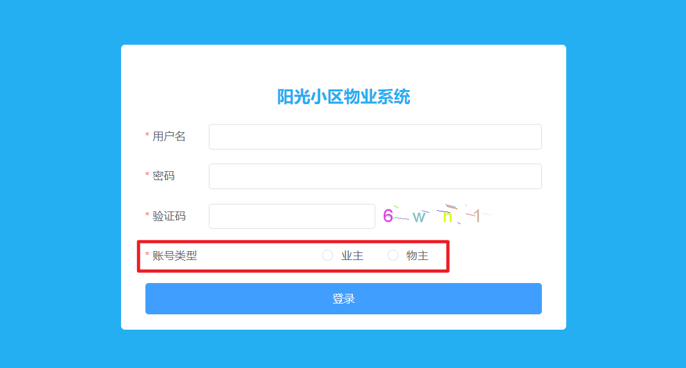
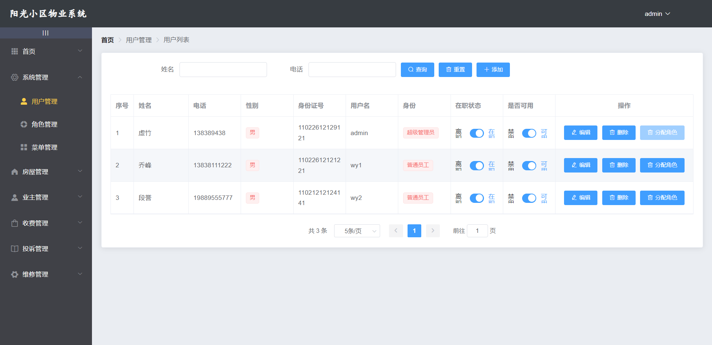
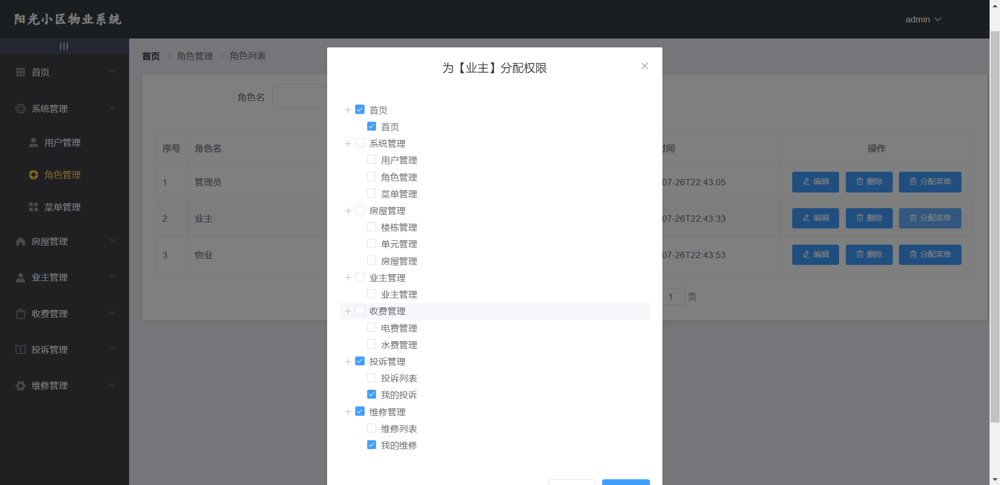
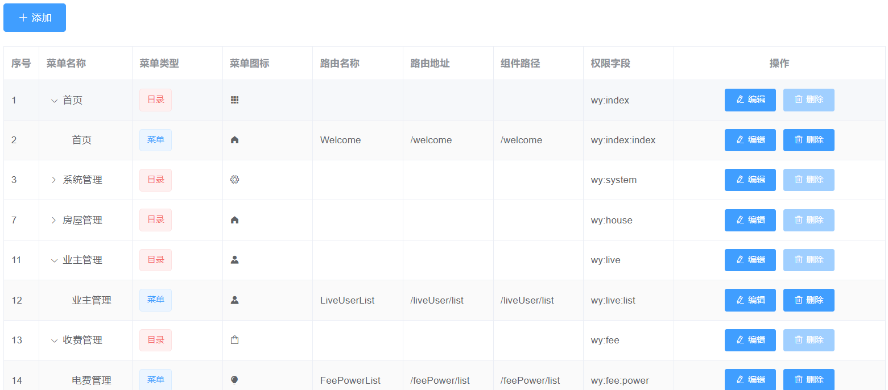
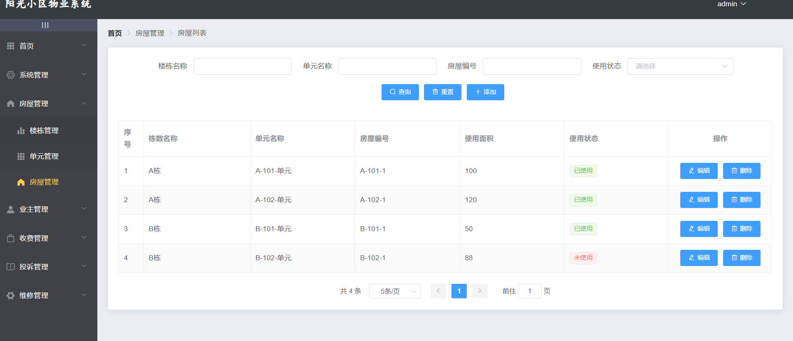
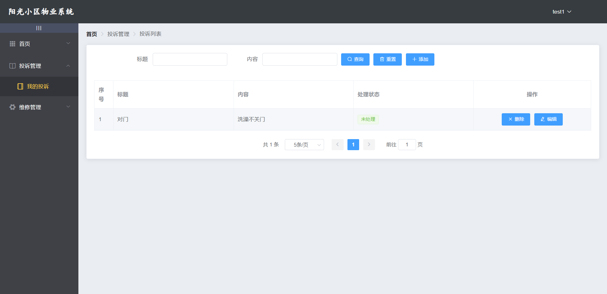

# 物业管理系统

## 技术栈

前端 Vue

后端 SpringBoot、SpringSecurity、MybatisPlus 

数据库 Mysql 、Mongodb

缓存 Redis

## 图示

#### 登录样式： 不同类型用户权限不同

### 管理员登录

#### 系统管理

#### 权限分配，树形结构

#### 菜单管理，树形结构

#### 房屋管理

### 业主登录（可以报修和投诉）

